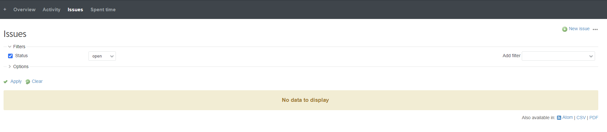
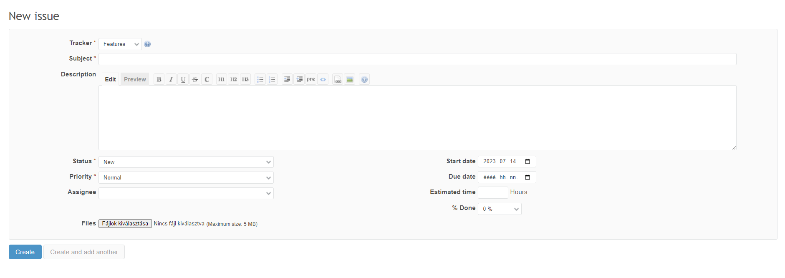
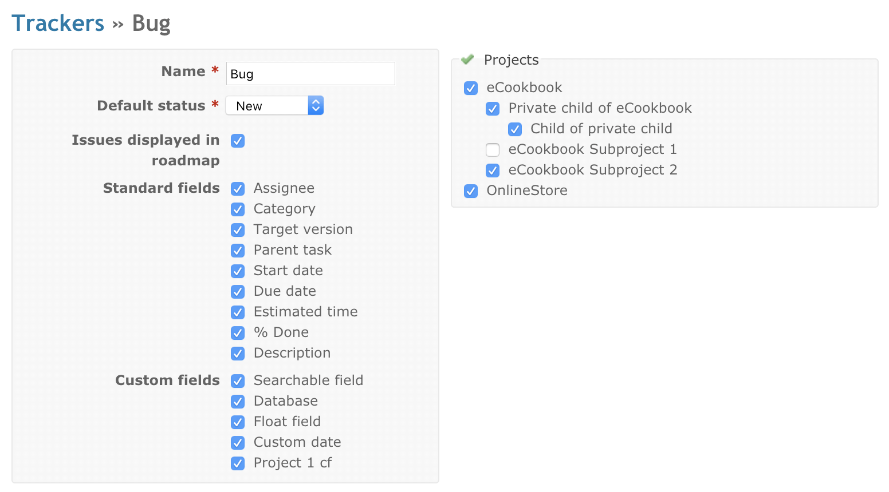
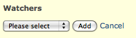
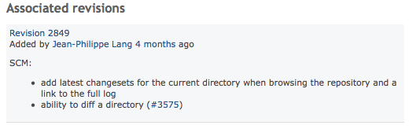
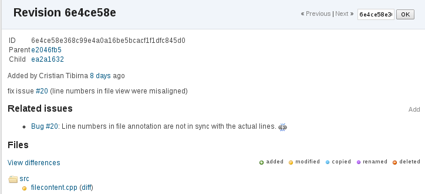
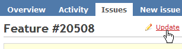
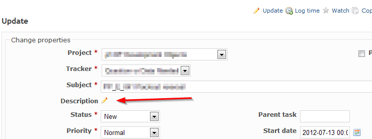
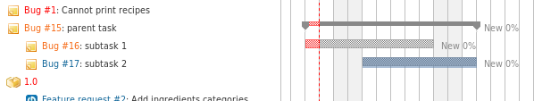

[Back to user page](USER.md)

[Back to main page](README.md)

## ISSUES

### Issue creation

1. On the project's page, locate the "New Issue" button or link. It is usually located near the top of the page or in the sidebar.

2. Click on the "New Issue" button/link to open the issue creation form.

3. Fill in the necessary details for the issue. This typically includes the tracker, subject/title, description, status,
   priority and any other relevant fields.

4. Optionally, you can assign the issue to a specific person or team member responsible for its resolution.
5. If desired, set the due date for the issue to indicate its deadline.
6. Attach any relevant files, screenshots, or additional documentation related to the issue.
7. Finally, click on the "Create" button to create the issue.

   Once the issue is created, it will be added to the project's issue tracker, and team members can view and work on it accordingly.

### Issue Tracking

Issues are the heart of the Redmine business. An issue is bound to a project, owned by a user, can be related to a version, etc.

#### Listing of the issue

From a selected issue page, you can see the work in progress that is done to fix the issue. The messages are displayed in chronological order, (to
change the order - see the setting in 'My Accounts'). It is possible to quote others' messages as well as to edit yours.

#### Related issues

'Related issues' allow developers to link issues to each other in order to remove duplicates or simplify their workflow.

It is possible to link issues based on various relations. Current relations are:

* **related to** - Just adds a link to the other issue.

* **duplicates** - Links issues so that closing one, will close the other (e.g. closing A will close B)  
  For example, if issue B **duplicates** A:  
  \- closing B will leave A open  
  \- closing A will automatically close B

* **duplicated by** - Reciprocal of _duplicates_.  
  For example, if issue A is **duplicated by** issue B:  
  \- closing B will leave A open  
  \- closing A will automatically close B

* **blocks** - Links issues so that closing one can be blocked by an issue which is still open  
  If issue B blocks A,  
  A can't be closed unless B is.
* **blocked by** - Reciprocal of _blocks_.

* **precedes** - Links issues to define an "order", where A needs to be completed x days before B can be started on  
  If B follows A, you can't give B  
  a starting date equal or less  
  than the ending date of A.
* **follows** - Reciprocal of _precedes_.  
  If issue B follows A (ex A ends the 21/04 and B begins the 22/04)  
  and you add +2 day at the ending date of A,  
  the starting and ending dates of B will be +2 too.

* **copied from** - Links issues to identify whether it was copied, and from which issue it was copied from.
* **copied to** - Reciprocal of _copied from_.

Administrators can define the permissions](/projects/redmine/wiki/RedmineRoles#Permissions) of users to add and edit such relations.

#### Watchers

Display a list of all the users who are watching this issue. If the issue is updated, those users will be notified.

If you are logged in as a project administrator, it is possible for you to add users to the watch list on this page. By clicking on the Add link,
a drop-down menu with an **Add** button appear, which allows you to select which user to add to the watch list.

Administrators can define the [permissions](PERMISSIONS.md) of users to add/delete watchers as well as to see the list of watchers.

#### Associated revisions

If the administrator has defined Referencing Issues Keywords, a developer that uses such keyword(s) will see its commit message displayed on the issue
page, under the Associated revisions block (generally to the right of the first reply).

Revisions can also be associated to issues manually, from a changeset (revision) view in the Repository browser. The manual associations are
reversible. They can be revoked by using the broken chain icon to the right of an added association, again in the changeset view.

#### Adding a new issue

People can create a new issue when they meet the [roles and permissions](PERMISSIONS.md) configured by the Redmine
Administrator ([Role: Issue Tracking > Add Issues](PERMISSIONS.md)).  
When creating a new issue, one of the most important items is the tracker field, which defines the nature of the issue. By default, Redmine comes with
three different trackers: _bug_, _feature_, and _support_.

#### Updating an existing issue

(TODO: describe and upload a screenshot of update panel)

To edit the issue, Click _Update_ link (having a pencil icon) at the top or the bottom of the issue page:

Depending you your role permissions (see [roles and permissions](PERMISSIONS.md)), you will see a complete or a limited set of editable issue
properties.

#### Editing an existing issue's Subject or Description

In order to edit an existing issue, your role has to have the Issue Tracking > Edit Issues right in the roles and permissions configuration.

1. Open the issue
2. Click _Update_ link (having a pen icon) at the top or the bottom of the issue page.

The description of the issue has pencil icon right next to it that you can click to change the description.

#### Subtasks

Sometimes it is useful to break huge tasks down into smaller subtasks to have more control over the task or to assign smaller parts of it to
different users. One can create a subtask by either clicking the 'Add' link in the subtasks section of the parent task or by filling the parents
task id into the 'parents task' field of the subtask. This is also possible after creation by updating the task. Because it's just a normal
task a subtask can also have subtasks. There is no limit in the depth of this stack.

Subtasks can belong to a different project than the parent task. This functionality is configurable in the settings section in the administration
menu. Defining subtasks requires the permission 'Manage subtasks' which can be set in the roles and permissions section in the administration menu.  
If a project gets copied the whole tree beneath the parent task is copied, too. When copying only the parent task one can choose if the subtasks
should also be copied.

#### Filtering & sorting

One can show the parents task id as sortable column in the issues list and there is also a filter option for it.  
When the list is sorted by the parent task id the subtasks hierarchy is displayed in an indented tree structure.  

As long as the tasks share the same target version the tree structure is also visible in the gantt view.  

#### Relations between the parent task and its subtasks

Some properties of the parent task are influenced by the subtasks underneath.  
The following relations exist between the parent task and its subtasks.

* The parent task's done percentage is the weighted average ratio of subtasks.
* The parent task's start is the lowest date of subtasks.
* The parent task's due date is the highest due date of subtasks.
* The parent task's spent time is the sum of the subtasks' spent times.
* The parent task's estimation time is the sum of the subtasks' estimation times.
* The parent task's priority is the highest of the subtasks' priorities.
* Subtasks are rescheduled when a 'precedes' relation is set on a parent task.

[Back to user page](USER.md)

[Back to main page](README.md)
