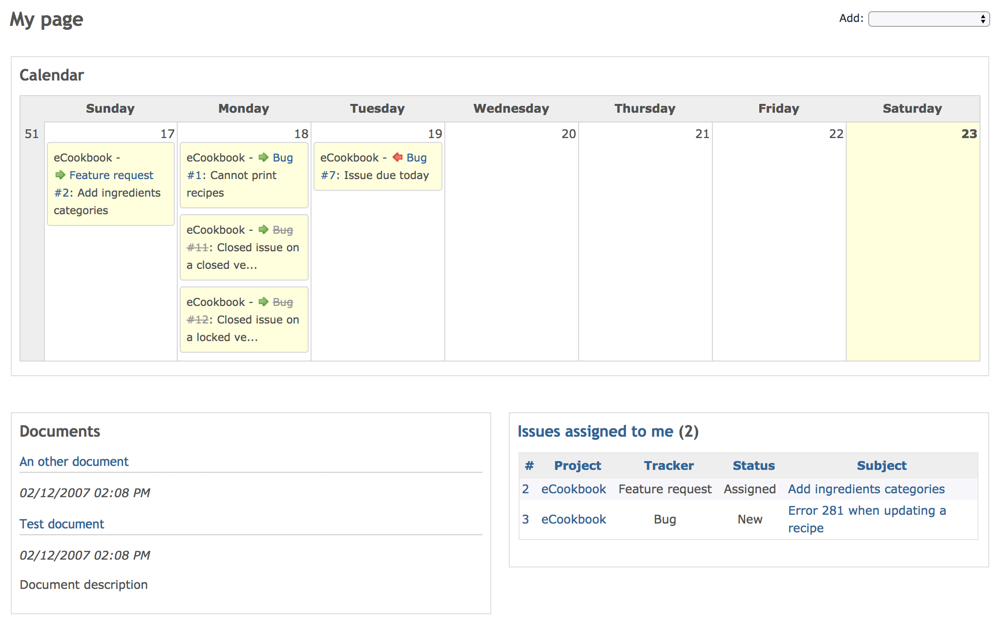

[Back to user page](USER.md)

[Back to main page](README.md)

### My page

My page lets you display various blocks of information about your projects. Users can personalize their own "My page" by adding, removing and
reordering blocks.

### Blocks

The following blocks are available. (Only "Issues assigned to me" and "Reported issue" block are enabled by default.)

The layout (as in positioning of the blocks) of the "My page" can also be re-ordered and modified using drag-and-drop.

**Issues assigned to me**

"Issues assigned to me" block provides a cross-project list of issues, which are assigned to the current user, showing the issue id's, projects,
trackers and subjects with the current issue status appended between braces.

**Reported issues**

"Reported issues" block provides a cross-project list of issues, which are reported by the current user, showing the issue id's, projects, trackers
and subjects with the current issue status appended between braces.

**Calendar**

"Calendar" block provides a cross-project weekly calendar overview.

**Documents**

"Documents" block provides a cross-project overview of the latest documents.

**Issues**

"Issues" block provides a list of issues returned by a selected custom query.

**Latest news**

"Latest news" block provides a cross-project overview of the latest news.

**Spent time**

"Spent time" block provides a cross-project overview of the spent time entries of the current user of the last seven days.

**Watched issues**

"Watched issues" block provides a cross-project list of issues, which are watched by the current user, showing the issue id's, projects, trackers and
subjects with the current issue status appended between braces.

[Back to user page](USER.md)

