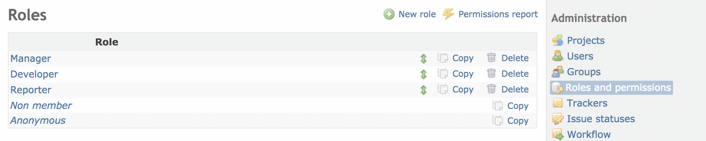

[Back to user page](USER.md)

[Back to admin page](ADMIN.md)

[Back to main page](README.md)

## Roles & permissions

A role is a collection of permissions. It lets you define the permissions that the members have on a project.

Each member of a project has one or multiples Role(s) for the project. If a member has multiple roles in a project, the permissions applied to the
member is the combination of all roles' permissions. A user can have different roles for different projects.

You can create new roles or edit existing ones. You can delete a role only if nobody has this role on a project.

#### Role properties

- Name: display name of the role
- Issues can be assigned to this role: if unchecked, issues can not be assigned to members with this role on a project.
- Issues visibility: controls issue visibility. Assuming that this role includes the View Issues permission, the following rules apply to the issues
  of the projects the user is tied to through it:
    - All issues : the user can see all issues.
    - All non-private issues: the user can see all issues which are not marked as private and private issues that were created by or assigned to
      her/him. This is the default.
    - Issues created by or assigned to the user: the user can only see issues created by or assigned to her/him.
- Time logs visibility: controls time log visibility. Assuming that this role includes the View spent time permission, the following rules apply to
  the time logs of the projects the user is tied to through it:
    - All time entries : the user can see all time logs. This is the default.
    - Time entries created by the user : the user can only see time logs created by or assigned to her/him.
- Users visibility: controls user visibility (this applies to user profiles, issue filters and user search when adding watchers). The following
  rules apply to the users of the projects the user is tied to through it and beyond:
    - All active users : the user can see all active users (i.e. all active user accounts that are registered in Redmine). This is the default.
    - Members of visible projects : the user can only see users who are members of visible projects.

### Permissions

| Permission                      | Description                                                                                                                                                  |
|:--------------------------------|:-------------------------------------------------------------------------------------------------------------------------------------------------------------|
| **_Project permissions_**       |
| Create project                  | Allow non-admin users to create a root projectYou can specify which role will be automatically given to a non-admin user who creates a project               |
| Edit project                    | Allow user to edit project properties                                                                                                                        |
| Close / reopen the project      | Allow user to close / reopen projects                                                                                                                        |
| Select project modules          | Allow user to enable/disable project modules (such as issues tracking, wiki, repository...)                                                                  |
| Manage members                  | Allow user to add/remove project members or change the roles of existing members                                                                             |
| Manage versions                 | Allow user to add/edit/delete project versions                                                                                                               |
| Create subprojects              | Allow user to add subprojects to the project                                                                                                                 |
| Manage public queries           | Allow user to save/edit/delete public project queries                                                                                                        |
| Save queries                    | Allow user to save/edit/delete their private queries                                                                                                         |
| **_Forums permissions_**        |
| View messages                   | Allow user to view the forums and forum activities                                                                                                           |
| Manage forums                   | Allow user to add/edit/delete project forums                                                                                                                 |
| Post messages                   | Allow user to post new topics in forums                                                                                                                      |
| Edit messages                   | Allow user to edit any message and to remove any message attachments                                                                                         |
| Edit own messages               | Allow user to edit its own messages only                                                                                                                     |
| Delete messages                 | Allow user to delete any topic or reply                                                                                                                      |
| Delete own messages             | Allow user to delete its own topics or replies                                                                                                               |
| **_Documents permissions_**     |
| Add documents                   | Allow user to add project documents                                                                                                                          |
| Edit documents                  | Allow user to edit project documents                                                                                                                         |
| Delete documents                | Allow user to delete project documents                                                                                                                       |
| View documents                  | Allow user to view documents                                                                                                                                 |
| **_Files permissions_**         |
| Manage files                    | Allow user to add/edit/delete project files under the Files section                                                                                          |
| View files                      | Allow user to view files                                                                                                                                     |
| **_Issue tracking_**            |
| Manage issue categories         | Allow user to add/edit/delete issue categories                                                                                                               |
| View Issues                     | Allow user to view project issues                                                                                                                            |
| Add issues                      | Allow user to create new issues                                                                                                                              |
| Edit issues                     | Allow user to fully edit existing issues                                                                                                                     |
| Copy issues                     | Allow user to copy existing issues                                                                                                                           |
| Manage issue relations          | Allow user to add/remove relations between issues                                                                                                            |
| Manage subtasks                 | Allow user to add/remove subtasks to issues                                                                                                                  |
| Add notes                       | Allow user to add comments to existing issues                                                                                                                |
| Edit notes                      | Allow user to edit any issue comment                                                                                                                         |
| Edit own notes                  | Allow user to edit its own comments only                                                                                                                     |
| Delete issues                   | Allow user to delete issues                                                                                                                                  |
| Manage public queries           | Allow user to add/edit/delete issue queries that are visible by all users                                                                                    |
| Save queries                    | Allow user to save its own issue queries                                                                                                                     |
| View gantt chart                | Allow user to view the gantt chart                                                                                                                           |
| View calendar                   | Allow user to view the calendar                                                                                                                              |
| View watchers list              | Allow user to see who is watching an issue                                                                                                                   |
| Add watchers                    | Allow user to add other users as watchers of an issue                                                                                                        |
| Delete watchers                 | Allow user to remove watchers of an issue                                                                                                                    |
| **_News permissions_**          |
| View news                       | Allow user to view the news section and news activities                                                                                                      |
| Manage news                     | Allow user to add/edit/delete project news                                                                                                                   |
| Comment news                    | Allow user to add comments to news                                                                                                                           |
| **_Repository permissions_**    |
| Manage repository               | Allow user to configure the project repository                                                                                                               |
| Browse repository               | Allow user to browse and view the content of the project repository                                                                                          |
| View changesets                 | Allow user to view the changesets                                                                                                                            |
| Commit access                   | Used by Redmine.pm to give write access to the project repositorySee                                                                                         |
| **_Time tracking permissions_** |
| Log spent time                  | Allow user to log time on the project                                                                                                                        |
| View spent time                 | Allow user to view the time logs on the project                                                                                                              |
| Edit time logs                  | Allow user to edit any time log                                                                                                                              |
| Edit own time logs              | Allow user to edit its own time logs only                                                                                                                    |
| Manage project activities       | Allow user add/edit/delete activities                                                                                                                        |
| **_Wiki permissions_**          |
| Manage wiki                     | Allow user to create or delete the project wikiDeleting a wiki is an **irreversible** operation, it deletes all pages, their history and all attached files! |
| Rename wiki pages               | Allow user to rename existing wiki page or assign wiki pages to a parent page                                                                                |
| Delete wiki pages               | Allow user to delete wiki pagesDeleting a wiki page is an **irreversible** operation, the page and all its history are deleted!                              |
| View wiki                       | Allow user to view the wiki                                                                                                                                  |
| Export wiki pages               | Allow user to export wiki pages to various formats (pdf, html, ...)                                                                                          |
| View wiki history               | Allow user to view older versions of the wiki pages, and diff between versions                                                                               |
| Edit wiki pages                 | Allow user to edit unprotected wiki pages                                                                                                                    |
| Delete attachments              | Allow user to delete existing wiki page attachments                                                                                                          |
| Protect wiki pages              | Allow user to lock/unlock wiki pages, and edit locked pages                                                                                                  |

#### System roles

There are two system roles in Redmine: **'Non-member'** and **'Anonymous'**. They are internally used by Redmine and thus cannot be deleted.

**Non-member:** this role lets you define the permissions that a registered user has on projects which he is not a member of.

**Anonymous:** this role lets you define the permissions that anonymous users have on the projects.

Note that these two roles only apply to public projects since anonymous users and users who are not a member of a private project cannot even see it.

As a consequence of the fact, that Anonymous and Non member roles cannot be assigned to a specific user or group, but are assigned automatically, the
permissions of these roles are global for a given Redmine installation. To be more concrete: You can create different developer-roles (
reporter1,reporter2,...) with slightly different permissions to fit specific needs of specific projects. However: you cannot adapt Anonymous and Non
member roles in a way, that non-members are allowed to create board-messages in one project, but are forbidden to do so in another project.

Some permissions cannot be given to these roles. For example, the 'Manage members' permission cannot be given to non-member or anonymous users.

[Back to user page](USER.md)

[Back to admin page](ADMIN.md)