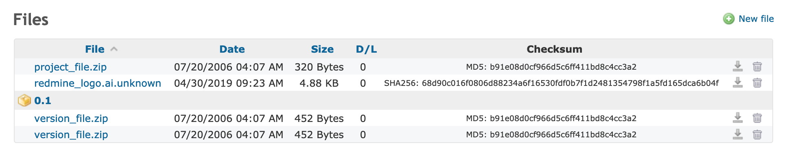
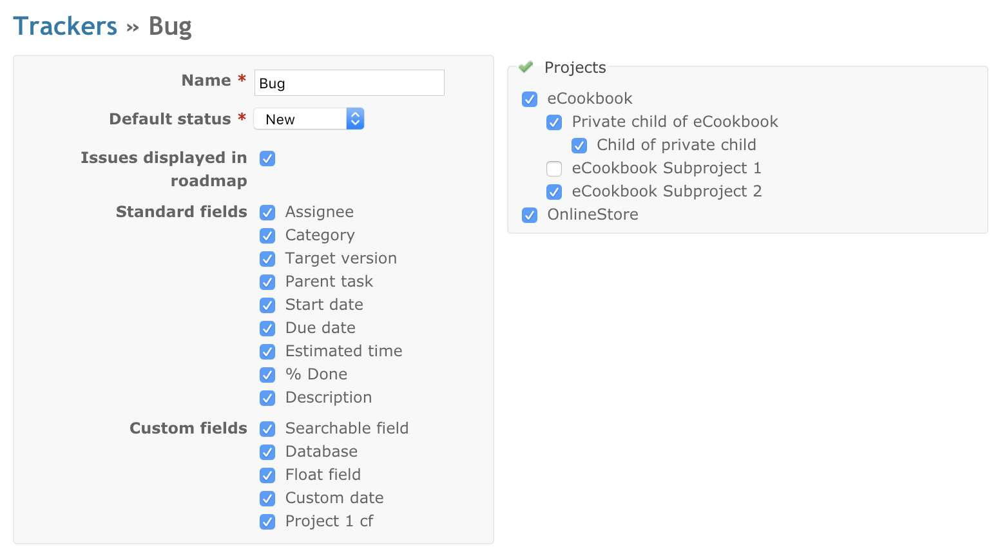

### Project modules

[Back to main page](README.md)

[Back to admin page](ADMIN.md)

#### Gantt chart

The Gantt module in Redmine provides a visual representation of project timelines using Gantt charts. It allows project managers to schedule tasks,
define dependencies, and track progress. The Gantt chart visually displays task durations, start and end dates, and helps in resource allocation and
project planning.

#### Calendar

The calendar provides an overview of the current project as a monthly view. This view displays all the issues that have at least a start date and
indicates their start date and (if available) their due date. The calendar also displays all versions which have a due date set.
Access to the module can be granted or denied at a role level.
To do this go to the administration page, follow the roles and permissions link, choose a role and check or uncheck the Calendar permissions checkbox.

#### News

In the news area you can publish news items about the project or any subject you like.

You can give the news item a title, a summary and the detailed description. The summary will be displayed in the Latest news area of the project
overview whereas the description will be displayed if you click on the title of the news item.

If you have the permissions to create news items, then you can add/edit/delete an existing news entry (see Redmine Permissions).

If you have the permission to create new news items, you have a green plus sign (+ Add news) in the upper right of you screen. If you click on that,
you can add a new news item. On this page, you have to insert the Title, Summary and Description of the news item.

#### Documents

By default, there are two categories for documentation:

1. User documentation
2. Technical documentation

These categories can be modified and other categories can be added by a Redmine administrator using document category enumerations.

##### Adding documents

- From the Documents tab press the New document link.
  

- Once documents have been uploaded, the title is used as the link to download the attached documents, and add more if necessary.

  

#### Files

Each project can have a Files module enabled/disabled via the settings menu.

A sortable table shows the details of all the uploaded files. If a version is selected while uploading a file, that file will be shown below the
version. Of note are the Checksum hash and D/L(Download Count).

New files are added via the New File button in the upper right hand corner.

##### File storage

All uploaded files are stored at the /{install dir}/files directory.

The uploaded file name is prefixed with a unique id based on it's parent for directory storage.

##### New file form

If a new file is added, the input form is as shown below. Select a version from the list to link a file to a specific version. Adding multiple files
at once is possible using the "Add another file" link.

The optional description is used for an alt text.

#### Forums

The forums allow users from a project to communicate with each others. The administrator defines a list of forums in the Project Settings.

The forum list displays the project forums overview:

- total number of topics
- total number of messages
- a link to the latest message

##### Adding a topic

To add a topic in a given forum, click on the forum name, then click on New message.

You can now enter a subject, a body and attach files to your message.
Two options are available:

- **sticky**: if checked, the topic will stay displayed at the top of topic list, in bold
- **locked**: if checked, users can not add replies to the message

#### Repository

The Repository tab lets you browse the project repository and view the latest commits.

You can expand a directory by clicking on +.
You can also enter a directory by clicking on its name.

Clicking a revision number will display the details of the commit.

To browse the repository at a given revision, enter the revision number in the upper-right field and hit Enter.

#### News

In the news area you can publish news items about the project or any subject you like.

You can give the news item a title, a summary and the detailed description. The summary will be displayed in the Latest news area of the project
overview whereas the description will be displayed if you click on the title of the news item.

If you have the permissions to create news items, then you can add/edit/delete an existing news entry (see Redmine Permissions).

If you have the permission to create new news items, you have a green plus sign (+ Add news) in the upper right of you screen. If you click on that,
you can add a new news item. On this page, you have to insert the Title, Summary and Description of the news item.

#### Issue tracking system

##### Trackers

Trackers are how you split your issues into different types - common ones are **Bug**, **Feature,** **Defect** or etc.

For each tracker, you can define: (see image below)

- Name (the example pictured is 'Bug')
- Default status (an issue status applied by default to new issues)
- If the issues bound to the tracker should be displayed on the roadmap
- A different workflow
- Standard and custom fields available for the tracker

When creating a new tracker, you'll need to define its Workflow (see below) in order to properly use it. (To save time doing that - you can copy an
existing tracker's workflow when creating a new one. To do that, select a tracker in the 'Copy workflow from' drop-down list on the 'New tracker'
screen).

**Issue statuses** can be added and deleted freely. Each status has the following configurable option:
**Issue closed:** indicates that the issue is considered as closed (more than one status can be declared as closed)

##### % Done

This option (and its column in the issue statuses overview) is only available if the "Calculate the issue done ratio" option in the application
settings has been set to "Use the issue status". By setting the option, an issue's done ration is automatically updated based on which status is
assigned instead of manually entering the done ratio for each issue.

If left blank, changing an issue to this status will not change its percent done.

##### Workflow

The workflow lets you define status transitions that the various project members are allowed to make on the issues according to their type.

On the workflow setup screen, select the role and the tracker for which you want to edit the workflow, then click 'Edit'. The screen lets you select
the authorized transitions for the chosen role and tracker. The "Current status" column indicates the initial status of an issue. The "New statuses
allowed" columns stand for the statuses that can be applied.

Note: For a user to change an issue status, they need to have either 'Edit issues' permission (see [Roles and permissions](PERMISSIONS.md)).

v

In the above example, Bugs with a New status could be given an Assigned or Resolved status by the Developer role. Those with an Assigned status could
get a Resolved status. The status of all the other Bugs cannot be modified by the Developer

**Fields permissions**

On this tab one can set special permissions to a field in a specific state. One can choose between the attributes read-only, required, or leave it
empty for default behavior. If the field is set as read-only it is hidden in the edit section and can not be changed by the selected role. If the
field is set to required it can not be left empty when the issue gets edited by the selected role.

[Back to main page](README.md)

[Back to admin page](ADMIN.md)