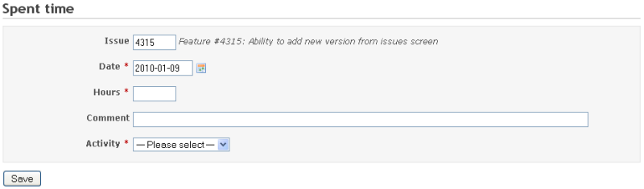
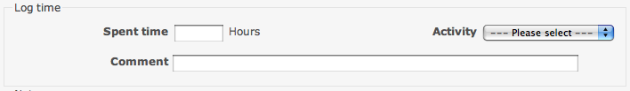

[Back to user page](USER.md)

[Back to main page](README.md)

### Time tracking

Time tracking allows users to track how many hours of work are logged to a specific issue or project. Each time entry of "spent time" can be
categorized by activity, and further explained with comments. By filling time estimates, project managers are able to produce better suited project
planning as well as follows individual user's progress.

Time tracking is always related to a user, thus it can be used to track how many billable hours this user has accomplished. See the spent time details
or spent time report pages for more information.

#### Logging time on an issue

You can log time on an issue by clicking Log time from the issue details view.

You can also log time when updating an issue.

### Logging time at project level

You can log hours at project level by leaving the issue field empty.

#### Accepted time formats

Estimated and spent time can be entered using either separated hour and minutes or combined in the following formats:

1. Separated: hour and minutes as an integer using standard time format: **`1h`**, **`1 h`**, **`1 hour`**, **`2 hours`**, **`30m`**, **`30min`**, *
   *`1h30`**, **`1h30m`**, **`1:30`**
2. Combined: as a fraction of hours in decimal time format using either period (.) or comma (,) as decimal separator: **`1.5`**, **`1,5`** (equals
   to `1h30`)

#### Decimal time format

When entering estimated or spent time values in Redmine using [decimal time format](http://en.wikipedia.org/wiki/Decimal_time) you have to be aware
that Redmine will also show accumulated time values in decimal time format.

Consider the following example:

* in a project you have 4 issues with the following spent time values: **1.00**, **0.10**, **0.15** & **0.40**. Now in the Spent Time reports (Project
  overview -> Spent time -> \[Details | Report\]) you will see the accumulated total of the decimal values of 1.65 hours (1 hour 39 minutes), not a
  separate accumulation of the hour and minutes after the decimal point (which would yield an incorrect value of 2.05 hours).

* _Explanation_: this is intended behaviour since the four spent time values are entered in decimal time format. The values are interpreted as
  follows:
    * 1.00 decimal equals 60 minutes (1 hour)
    * 0.10 decimal equals 6 minutes
    * 0.15 decimal equals 9 minutes
    * 0.40 decimal equals 24 minutes
    * 1.65 decimal equals 99 minutes
    * 2:05 hours (125 minutes) equals 2.0833333333333335 (est.) in decimal notation

Due to rounding of the decimal values to two decimals done when showing an accumulated value there can possibly be a tiny difference (as can be seen
from the 2:05 example above).

Some references:

* [http://en.wikipedia.org/wiki/Decimal\_time](http://en.wikipedia.org/wiki/Decimal_time)
* [http://www.springfrog.com/converter/decimal-time.htm](http://www.springfrog.com/converter/decimal-time.htm)

### Logging time via commit messages

A handy feature for developers committing to SCM systems integrated with a Redmine instance is that they can register "spent time" against an issue
via their commit messages when referencing an issue.

For this to work the **Enable time logging** option must be activated under _Application settings -> Repositories_. Also, the activity under which
spent time is logged must be explicitly choosen in the **Activity for logged time** option under _Application settings -> Repositories_  (the default
activity 'Default' doesn't work).

The time specification in the commit message can be any of the above accepted time formats but must be preceded with a valid issue reference as
configured under "Referencing and fixing issues in commit messages" in _Application settings -> Repositories_.

An example using the default issue referencing keyword "refs":

    Fixed something, refs #435 @1h30

This commit message will add 1 hour and 30 minutes of spent time on issue #435.