### Life of an admin

[Back to main page](../README.md)

### Main admin tasks

- [Installation & configuration](https://www.redmine.org/projects/redmine/wiki/RedmineInstall):
  the administrator is responsible for installing and configuring the Redmine application on the server.
  This includes setting up the required dependencies, configuring the database connection, and specifying other system settings.

- User and Role Management: The administrator manages user accounts and permissions within Redmine. They create user accounts, assign roles to users,
  and define the access levels and permissions for each role. They can also handle user authentication methods, such as LDAP or single sign-on (SSO)
  integration.

- [System maintenance](https://www.redmine.org/projects/redmine/wiki/RedmineUpgrade): The administrator performs routine maintenance tasks to
  ensure the smooth functioning of Redmine. This includes updating the
  application to the latest version, applying patches and security updates, and monitoring system performance.

- Plugin Management: Redmine offers a wide range of plugins that extend its functionality. The administrator can install, update, and configure
  plugins based on the requirements of the organization or project.

- Customization and Workflow Configuration: Redmine allows for customization of its interface, fields, and workflows. The administrator can customize
  the look and feel of Redmine, create custom fields, and configure project workflows to align with the organization's processes.

- [User creation](#user-creation)
- [Project creation](#project-creation)
- [Project overview](#project-overview)
- [Group creation](#group-creation)
- [Enumeration](#enumeration)
- [Custom fields](#custom-fields)
- [Custom field data types](#custom-field-supporting-data-types)
- [Admin information](#admin-information)

### User creation

1. Click on "Administrator" in order to access admin page

   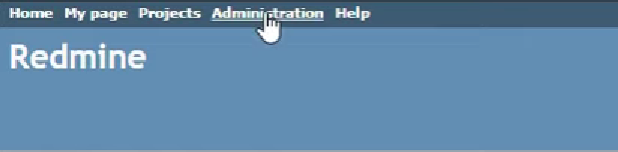

2. Here you can choose between different management options

   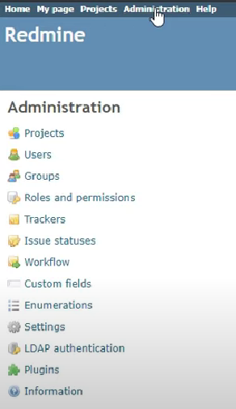

3. On the users page you can see all the users belonging to this account. Click on 'new user' in order to register a new user

   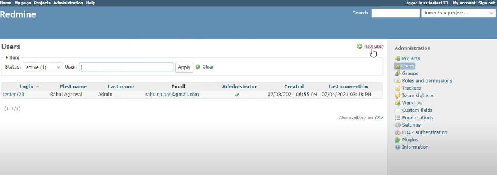

4. The new user page allows us to specify every detail about our user

   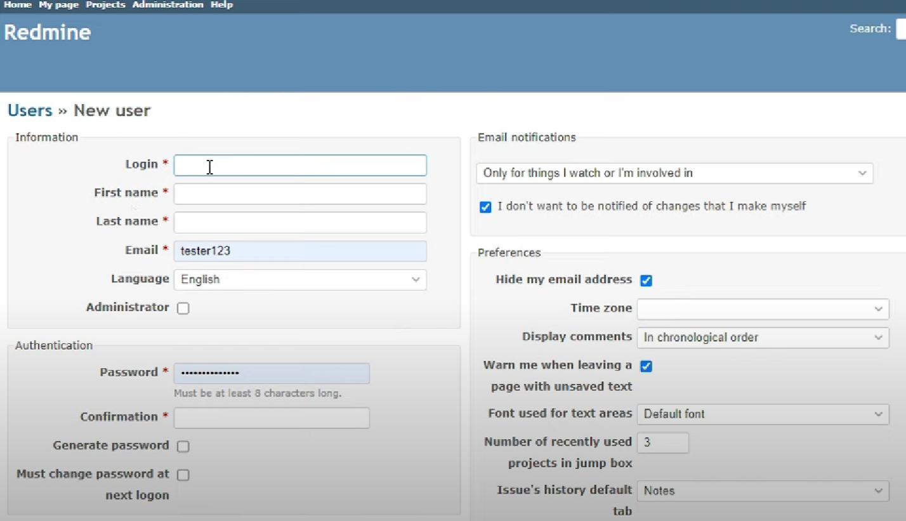
    - Login: this is what the user will have to use to log in. Can be referred to as username.
    - Administrator checkbox: we can register other administrators
    - Authentication: we can generate or write our own password. It can be specified when it has to be changed.
    - E-mail: we can tell Redmine what we want to receive e-mails about:

      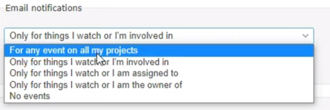

    - Preferences: there are some personal preference options such as e-mail hiding, font type and size,
      or comment sorting
5. Once our user is created we can further manage it. By clicking 'lock' we can deactivate the user, or even delete it.

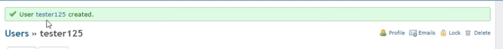

### Project creation

1. Click on "Projects" to access the project list

   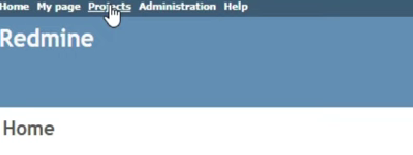

2. On the project page we can see our existing projects, we can filter them in several ways, and we can also create new ones by clicking on 'new
   project'

   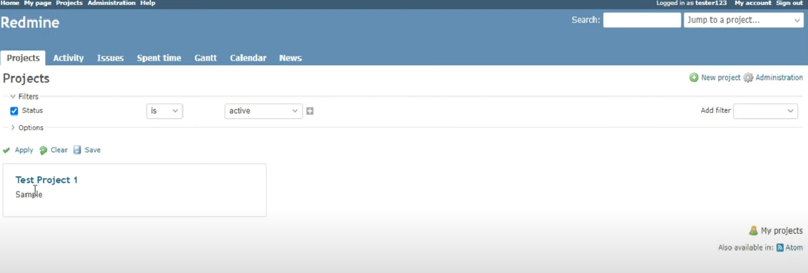

3. Creating a project is straightforward. Add a name, description, identifier (which will be the path), accessibility(public or private) and we
   can also tell if the project is connected to another project. If we check the 'inherit members' checkbox, the created project will have the
   same people working on it as the other project.

   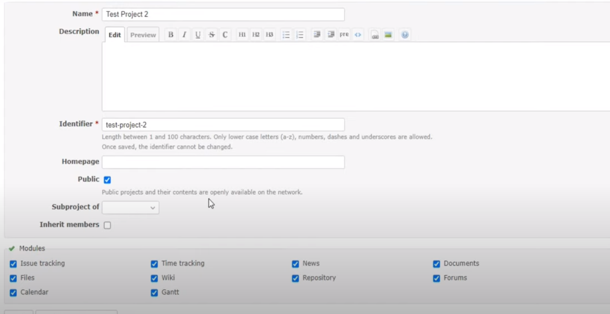

4. We can also choose the modules we want to be present in the project. Detailed description about the modules can be found
   here: [Module details](PROJECTMODULES.md)
5. After we created our project we can further manage its own page. More on this here:

   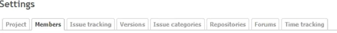

    - we can add and remove members and give them roles withing the project
        - roles are allowing us to have someone work on a project as a manager and work on another as just a reporter
    - at issue tracking we can specify what kind of issues we want to track and see advancements about

      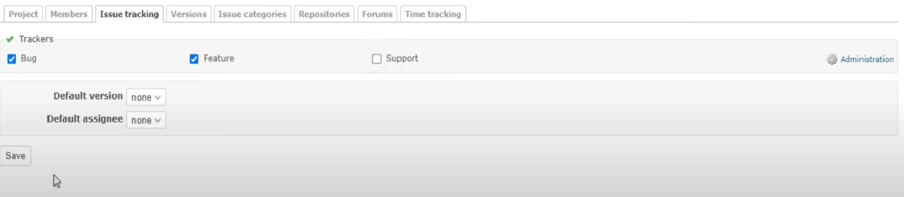

      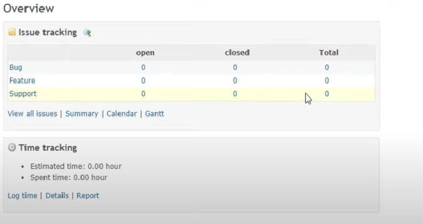

    - there is an option for versioning the project

      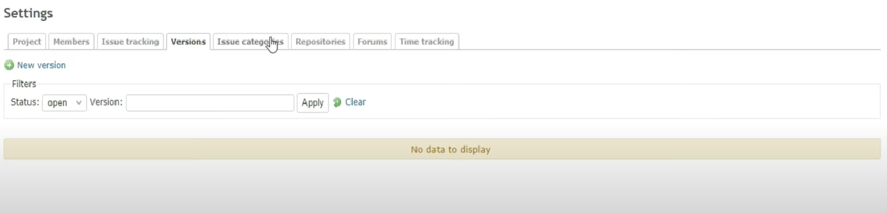

    - we can specify new issue categories
    - repositories can be added to the project
    - we can also create forums for easier communication between colleagues

### Project Overview

The Project overview will give you an overview of the whole project. On left upper side in the Issue tracking area you will get an overview of how
many task are open and closed for each tracker specified for the project. In the Members area you can see who are the members of the given project and
in particular who is the administrator of the project. In the Latest news area you can see which are the latest news for the particular project.
More project info [here](PROJECTINFO.md).

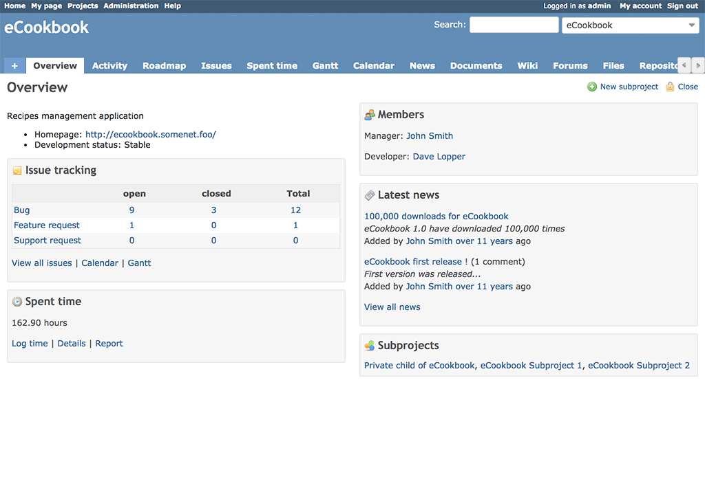

On the upper right side you see Sign in and Register. The Sign-in link allows those who have an account for this project to log in. The Register link
allow unregistered users to register themselves, allowing them to be part of any projects contained within this installation of Redmine.

Note that the Register link can be disabled by the administrator.

### Group creation

Administrators can define groups of users in Redmine.
Groups can be added as members of projects just like regular users, using the same Roles too.

When adding a user to an existing group, this user inherits of all the group privileges.

To create a group, do the following:

1. Click Administration
2. Click Groups
3. Click New Group
4. Type the name of your group in Name
5. Click Create

To add members to a group, do the following:

1. In Administration >> Groups
2. Click the name of the Group you wish to change.
3. You'll see 3 tabs: General, Users, Projects
    - General
        - Change the name by editing the Name field
    - Users
        - Add users by checking the username box for each user
        - Click Add
    - Projects
        - Select a project from the pop-up menu
        - Set the Role
        - Click Add

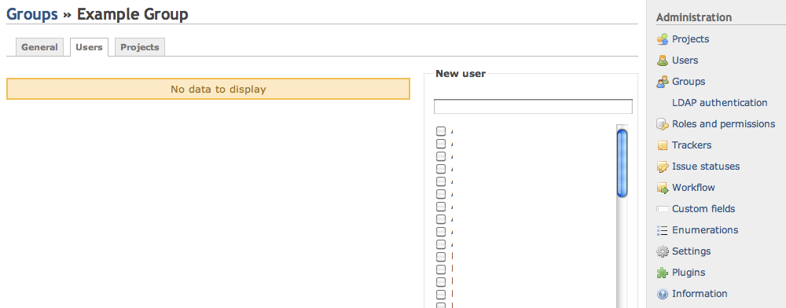

- Example Group Users tab

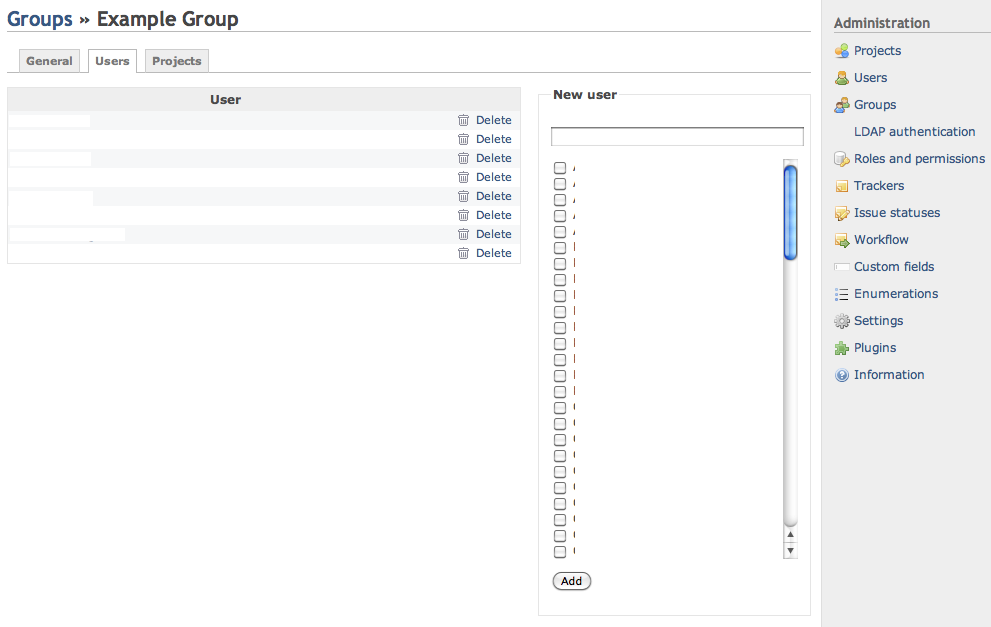

- Adding Members to a Group

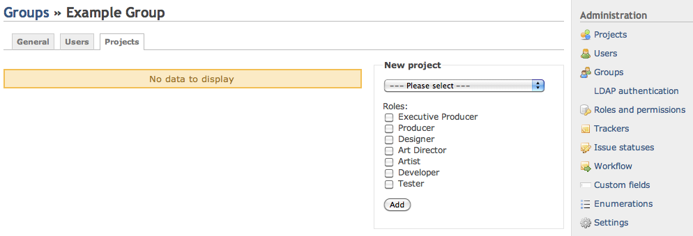

- Group Project tab

- Associating a group to a project (from the Group context)

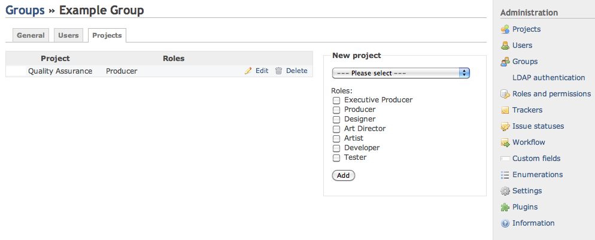

### Enumeration

Enumerations are global (cross-project) values for several parts of the Redmine system:

- Activities (time tracking)
- Document categories
- Issue priorities (sorted from lower priority to higher priority)

These items can be added, modified and deleted freely. They all have one configurable setting which is if the current enumeration should be the
default value.

If the default-value checkbox is ticked, the selected enumeration will be the default value for the specific field(s). If no enumeration has been set
to the default-value for the specific enumeration-category (activities, document categories or issue priorities) no enumeration will be pre-selected
for the specific field(s).

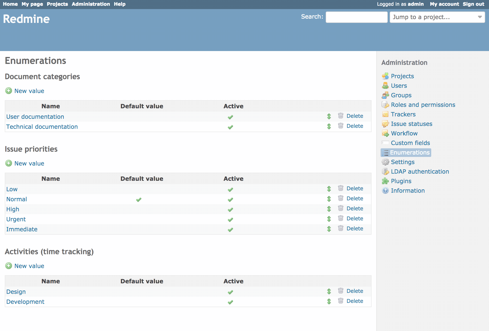

### Custom fields

Custom fields allow you to add additional information to several types of data used in Redmine. See 'custom field types' for all types of data which
come with support for custom fields.
Each custom field can be defined to be of a certain type.

#### Custom field types

- Boolean: checkbox
- Date: date
- Float: floating point number
- Integer: positive or negative number
- Link: URL
- List: drop down list
- Long Text: resizeable multiple lines of text
- Text: multiple lines text
- User custom field format that can be used to reference a project member
- Version custom field format that can be used to reference version

Some validations can be defined for each custom field:

- **Min - max length:** minimum and maximum length for the field (0 means that there is no restriction)
- **Regular Expression:** a regular expression can be used to validate the field content. Examples:

1. 4 capital letters followed by one or several digits

       ^\[A-Z]{4}\d+$

2. characters only, no digits

         ^[^0-9]*$

A full list of regular expressions can be found in the Ruby Users Guide.

#### Values

Some field support multiple values and default values:

- Multiple values: while enabled, more than one item may be selected.
- Possible values: possible values for the "List" fields. One line for each value.
- Default value: default value to apply if none selected.

#### Input field styling

- Boolean: checkbox (enabled/disabled) or radio buttons (null/yes/no)
- List, User and Version:
    - checkboxes (if Multiple values is enabled)
    - radio buttons (if Multiple values is disabled)

### Custom field supporting data types

#### Fields for issues

Data in issue custom fields can be used and/or will be displayed in issues, issue lists, custom queries and the Timelog report.

- Trackers
- Required: field which is required in order to create/save an issue
- For all projects: if checked, this field is used for the issues of all the projects. If unchecked, each project can choose whether to use
  the field for its issues (see Project settings).
- Used as a filter
- Searchable: field which is searchable using the Redmine search function

#### Fields for Spent time entries

Data in spent time entry custom fields can be used and/or will be displayed in the Timelog Report.

* **Required**: field which is required in order to create/save a spent time entry

#### Fields for Projects

Data in project custom fields can be used and/or will be displayed in the Project overview.

* **Required**: field which is required in order to create/save a project
* **Searchable**: field which is searchable using the Redmine search function

#### Fields for Versions

Data in version custom fields can be used and/or will be displayed in the Roadmap and
the Version overview.

* **Required**: field which is required in order to create/save a version

#### Fields for Users

Data in user custom fields can be used and/or will be displayed in the user profiles.

* **Required**: field which is required in order to create/save a user
* **Visible**: field which is displayed in the user profile
* **Editable**: field which is editable by the Redmine user owning the user account

#### Fields for Activities (time tracking)

Data in time tracking activity custom fields can be used and/or will be displayed in the Timelog report and the Project settings.

* **Required**: field which is required in order to create/save an activity

### Admin information

You can see the following three kinds of information on the "Administration" > "Information" page:

* The version of the Redmine
* The table shows if some important configurations are done correctly
* Environment information of the Redmine server

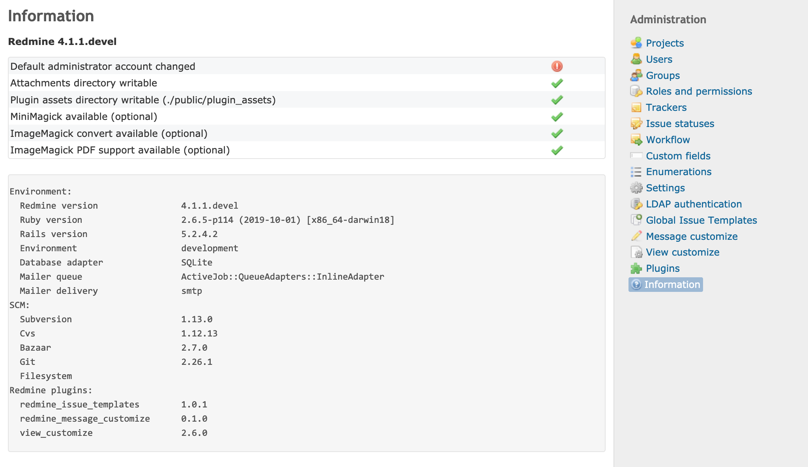

#### Redmine version

At the top, you can see the version of Redmine. The version number has a suffix "stable" or "devel". Normally, it should be "stable".

"devel" is shown when you are running Redmine with the development source code (the contributors call it as "trunk"). Since the trunk is not as stable
as released versions, you should only use the trunk only when you want to be involved in the development of Redmine or try new features of the next
release. It is not recommended to use the trunk in production is not recommended.

#### Status of important configurations

Just below the Redmine version, you can see a table showing the status of the important settings. An exclamation mark is displayed if any problems are
detected.

#### Default administrator account changed

It indicates whether the password of the admin account has changed from the default "admin". If you see an exclamation mark, change the admin
account's password immediately.

#### Attachments directory writable

It indicates whether the directory for storing attachments is writable. The default path of the directory is `files` under the installation directory,
which can be changed by `attachments_storage_path` in `config/configuration.yml`.

If an exclamation mark is displayed, users cannot upload files. Set write permission to the directory so that Redmine can store files.
See [RedmineInstall](https://www.redmine.org/projects/redmine/wiki/RedmineInstall) for further information.

#### Assets directory writable

It indicates whether the directory for storing plugin assets, `public/plugin_assets` under the installation directory, is writable.

If an exclamation mark is displayed, Redmine may raise an exception at startup after you install or update plugins. This is because Redmine will fail
to copy images and CSS used by plugins to the directory. Set write permission to the directory so that Redmine can store files.

#### MiniMagick available

It indicates whether MiniMagick gem used for image processing is available.

An exclamation mark is displayed only if you set `--without minimagick` option when you run bundler during the installation of Redmine. You can fix it
by running bundler again with setting `--without ''` option. See also for more about bundler.

#### Convert available

It indicates whether the `convert` command, a part of ImageMagick, is available.

If `convert` command is not available, some features such as displaying thumbnails of images and exporting gantt in PNG image are disabled. You can
fix this by installing ImageMagick. if the check fails even though ImageMagick is installed, you may have to configure `imagemagick_convert_command`
in `config/configuration.yml`.

#### ImageMagick PDF support available

It indicates whether ImageMagick `convert` command on the server supports PDF files.

When it is not available, the feature to display thumbnails for PDF files is disabled. You can fix this by installing both ImageMagick and
GhostScript.

#### Environment information

It displays a variety of information about the environment that the application is running in.

It is recommended to include this information when reporting issues to plugin developers, the Redmine team, and so on. The information helps them to
investigate issues.

[Back to main page](../README.md)
