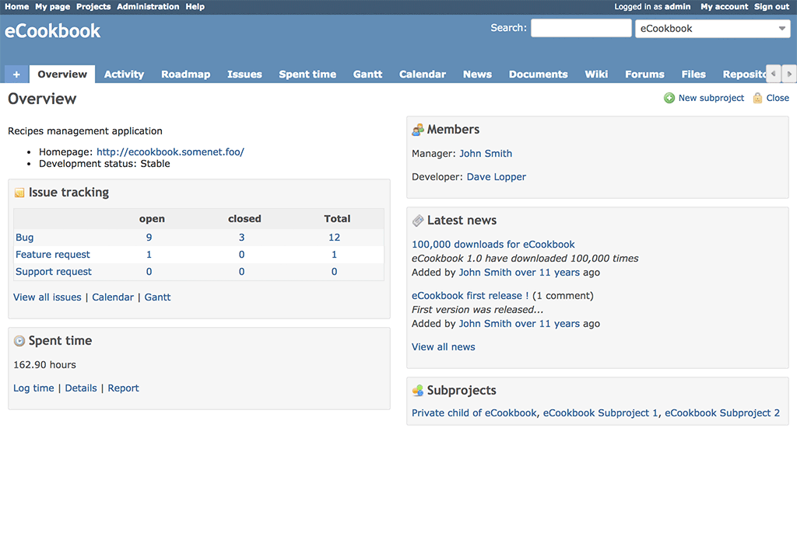

[Back to user page](USER.md)

[Back to main page](../README.md)

### Project overview

The Overview section in Redmine provides a high-level summary of important project information and metrics. It typically includes key details and
statistics related to the project, allowing users to quickly assess its status and progress.
More project info [here](PROJECTINFO.md).

### Project activity

The Project Activity section in Redmine displays a chronological list of recent activities and changes that have occurred within a particular project.
It provides a real-time feed of updates, including new issues, issue status changes, comments, attachments, and other relevant actions performed by
project members.

Using the checkboxes in the sidebar of the right, you can choose which items are displayed.

[Back to user page](USER.md)

[Back to main page](../README.md)
